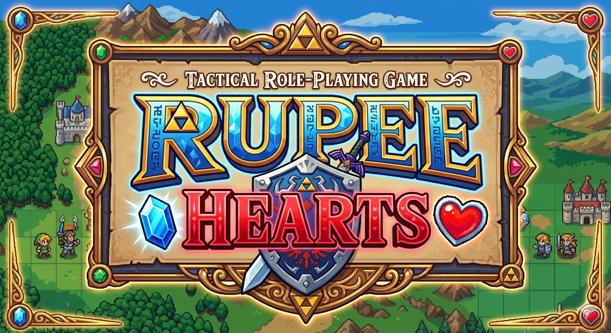

# Rupee Hearts

A tactical RPG in the style of Final Fantasy Tactics and Vandal Hearts, set in the Zelda universe.

AI assisted assets and code.

## Prototype

A working battle prototype on a hand-crafted 6×6 map with 2 player units vs 2 enemies.

**Controls**
- **A / D** — rotate camera left / right
- **W / S** — zoom in / out
- **Move / Attack / Item / Wait / Cancel** — action menu buttons (appear on player turn); Item opens a sub-list of usable items
- **Left click** — select a highlighted cell to move, attack, or use an item; click any unit or turn order portrait to inspect their stats
- **Right click / Escape** — cancel targeting or attack confirmation

**Systems implemented**
- FFT-style CT (Charge Time) turn order — units act when their CT bar fills based on their speed stat
- Grid-based movement with BFS flood fill and move-point costs; `jump` stat caps max climbable height per step; `flying` units ignore the climb cap and count as elevated for combat
- Terrain height affects both damage and accuracy (higher: +15%, lower: −10%)
- Directional facing system — front/side/back damage multipliers (×1.0/×1.25/×1.5); units auto-turn toward their attacker; player chooses facing at end of turn
- Item system — shared pool of Healing Potions; targets self or adjacent tiles within jump range; green tile highlights indicate valid targets
- Unit stats panel — click any unit or turn order portrait to slide in a colour-coded card (blue = ally, red = enemy) showing portrait, HP, and full stats; attack confirmation screen shows both combatants with hit chance and estimated damage before committing
- Greedy enemy AI — closes on nearest player unit and attacks when in range
- Visual tile highlights: blue = movement range, red = attack range, green = item targets
- Terrain occlusion — tiles blocking unit visibility are replaced with a dithered semi-transparent version so units behind terrain remain visible
- Chariot Tarot — branching timeline rewind; cancel restores full turn state

## Development

Open `godot/project.godot` in **Godot 3.6.2** and press F5 to run.

See [.claude/PROTOTYPE_PLAN.md](.claude/PROTOTYPE_PLAN.md) for the full architecture and build plan.
